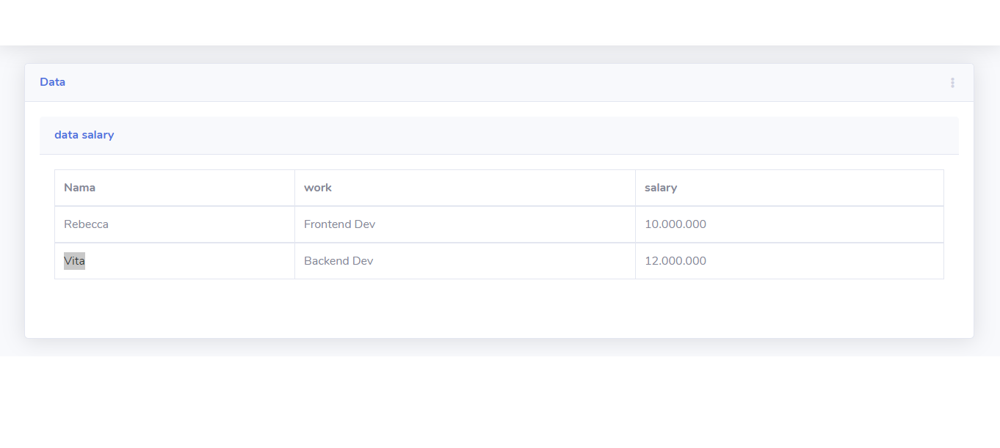

# bootcamp
cara menggunakan klik link di setiap nomornya 

sola satu 
1. https://repl.it/join/awqkpvqs-miftakhurohmah

soal dua 

2. https://repl.it/join/slomwhwv-miftakhurohmah

soal tiga

3. https://repl.it/join/uyqujfyu-miftakhurohmah

soal empat

4.

soal lima

5. 

soal enam

a.

---
---membuat database
----
CREAT DATABASE bootcamp

--
-- Struktur dari tabel `kategori`
--

CREATE TABLE `kategori` (
  `id` int(10) NOT NULL,
  `salary` varchar(20) NOT NULL
) ENGINE=InnoDB DEFAULT CHARSET=latin1;

--
-- Dumping data untuk tabel `kategori`
--

INSERT INTO `kategori` (`id`, `salary`) VALUES
(1, '10.000.000'),
(2, '12.000.000');

-- --------------------------------------------------------

--
-- Struktur dari tabel `name`
--

CREATE TABLE `name` (
  `id` int(10) DEFAULT NULL,
  `name` varchar(30) DEFAULT NULL,
  `id_work` int(9) DEFAULT NULL,
  ` id_salary` int(9) DEFAULT NULL
) ENGINE=InnoDB DEFAULT CHARSET=latin1;

--
-- Dumping data untuk tabel `name`
--

INSERT INTO `name` (`id`, `name`, `id_work`, ` id_salary`) VALUES
(1, 'Rebecca', 1, 1),
(2, 'Vita', 2, 2);

-- --------------------------------------------------------

--
-- Struktur dari tabel `work`
--

CREATE TABLE `work` (
  `id` int(10) NOT NULL,
  `work` varchar(30) NOT NULL,
  `id_salary` int(10) NOT NULL
) ENGINE=InnoDB DEFAULT CHARSET=latin1;

--
-- Dumping data untuk tabel `work`
--

INSERT INTO `work` (`id`, `work`, `id_salary`) VALUES
(1, 'Frontend Dev', 1),
(2, 'Backend Dev', 2);

---
---Query joiner untuk menampilakan hasil name , work, dan salry 
---
SELECT name.name,work.work,kategori.salary FROM name JOIN work ON name.id_work=work.id JOIN kategori ON work.id_salary=kategori.id

b. https://www.figma.com/file/5b2wwgYO9vh5AhgGLTFHb0/Untitled?node-id=0:1

c . 

